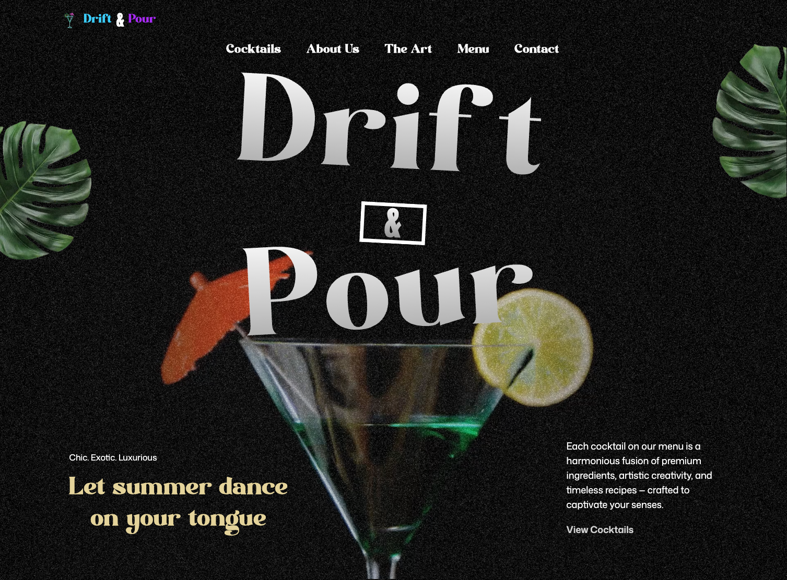

# 🍹 GSAP Cocktails Website



This is my personal version of the project built by following the detailed tutorial on the JavaScript Mastery YouTube channel: https://www.youtube.com/watch?v=AW1yfBKRMKc&t=2s

## 🤖 Introduction

BDesign and launch a visually impressive cocktail-themed website powered by **_GSAP_**, built with **_React_** and **_Tailwind CSS_**. This modern, scroll-interactive experience is loaded with high-level animations. Animate your content with expressive SplitText effects, fluid parallax motion, and scroll-triggered transitions using GSAP's ScrollTrigger. Pin sections during scroll for immersive storytelling, link video playback to scrolling for a cinematic feel, and apply scroll-based image masking for dramatic visual flair. Develop a fully customized animated carousel, create smooth timeline animations that span multiple sections, and deliver a fully responsive interface that looks great on any device.

## 🌐 Live Demo

Experience the Interactive Web:
🔗 https://react-gsap-cocktails.vercel.app/

🌍 Deployment
This app is deployed via Vercel, enabling fast global hosting with zero-config.

## 🔋 Features

✅ SplitText Animations
✅ ScrollTrigger Effects
✅ Parallax Scrolling
✅ Pinned Sections
✅ Scroll-Synced Video Playback
✅ Video Masking Effects
✅ Custom Animated Carousel
✅ Multi-Section Timeline Animations
✅ Responsive Design

And much more, including enhanced performance and scroll behavior!

## ⚙️ Tech Stack

### 🔧 Core Libraries

- **GSAP**: JavaScript animation library used for:

  - SplitText reveals
  - ScrollTrigger timelines
  - Parallax scrolling
  - Scroll-synced animations and pinning
  - Carousel transitions

- **React 19**: Component-based architecture for building interactive UIs.

- **Tailwind CSS 4**: Utility-first CSS framework for rapid UI development.

- **Vite**: Lightning-fast bundler with instant HMR and optimized builds.

## 🤸 Quick Start

✅ Prerequisites
Make sure you have the following installed:

Git

Node.js

npm (comes with Node)

## 🤸 Installation

```bash
# 1. Clone the repository
git clone https://github.com/delafuentej/react-gsap_cocktails.git
cd react-gsap_cocktails

# 2. Install dependencies
npm install
# or
yarn

# 3. Start the development server
npm run dev
# or
yarn dev
```
